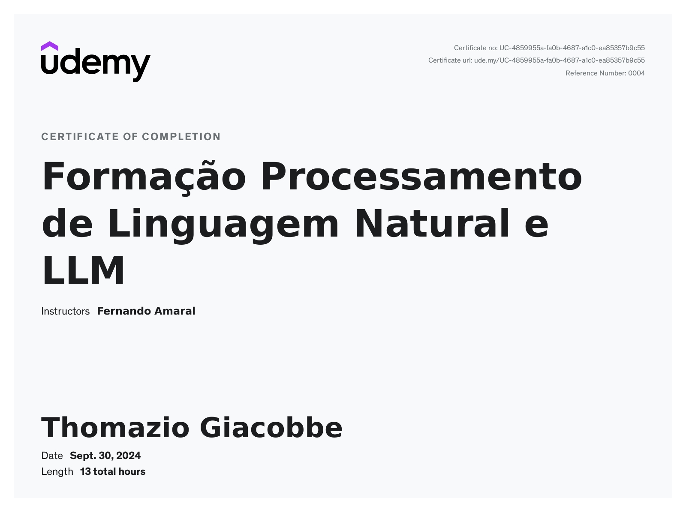

# NLP Course

This repository contains scripts and notebooks developed as part of the Udemy course 
[Formação Processamento de Linguagem Natural e LLM](https://www.udemy.com/course/formacao-processamento-de-linguagem-natural-nlp). 
The projects were implemented in Google Colab, showcasing concepts and practical applications in Natural Language Processing (NLP).

